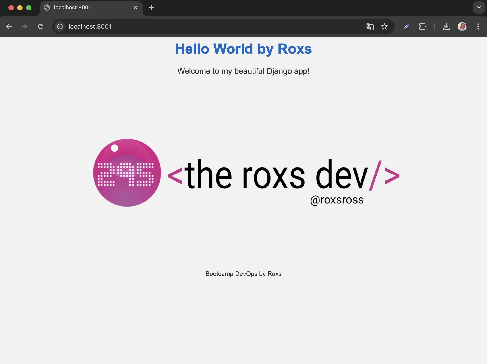

# Bootcamp DevOps by RoxsRoss


---


🔥🔥🔥🔥

# Desplegar una Aplicación Django 

## Requisitos Previos

* Django
* Conocimientos básicos sobre Docker
* Cuenta en AWS
* La creatividad siempre es un plus 😃

## Framework Web Django

***Django es un framework web de alto nivel en Python que fomenta un desarrollo rápido y un diseño limpio y pragmático. Es gratuito y de código abierto, tiene una comunidad activa y en crecimiento, una excelente documentación y muchas opciones de soporte gratuitas y de pago. Utiliza HTML/CSS/Javascript para el frontend y Python para el backend.***



## Pasos para Desplegar

### Construir la Imagen Docker

Usa el siguiente comando para construir la imagen Docker con un nombre específico:

```bash
docker build -t django-app:version-1 .
```

### 3. Verificar la Imagen Docker

Asegúrate de que la imagen se ha creado correctamente:

```bash
docker images | grep django-app
```

### 2. Crear Repositorio en Docker Hub

Para almacenar la imagen en Docker Hub:

- Crea una cuenta en [Docker Hub](https://hub.docker.com/).
- Inicia sesión en Docker Hub desde tu terminal:

  ```bash
  docker login
  ```

- Etiqueta tu imagen para Docker Hub:

  ```bash
  docker tag django-app:version-1 yourdockerhubusername/django-app:version-1
  ```

- Sube la imagen a Docker Hub:

  ```bash
  docker push yourdockerhubusername/django-app:version-1
  ```

### 3. Probando el contenedor


  ```bash
  docker run -d -p:8000:8000 yourdockerhubusername/django-app:version-1
  ```

## ¡Felicidades! 🙂


**Hemos desplegado con éxito nuestra aplicación Django.**

### Consideraciones Adicionales

Cuando despliegues una aplicación Django en producción, considera lo siguiente:

* **Seguridad:** Asegúrate de que la aplicación y el entorno estén protegidos.
* **Monitoreo:** Implementa herramientas para monitorizar el rendimiento y los logs.
* **Balanceo de carga:** Usa balanceadores de carga para distribuir el tráfico.
* **Planes de recuperación:** Ten un plan para recuperar la aplicación en caso de fallos.

# ¡Dale una Estrella! ⭐

***Si estás planeando usar este repositorio para aprender, por favor dale una estrella. ¡Gracias!***


> Recuerda documentar los pasos y decisiones tomadas durante la configuraciónde este proyecto ¡Buena suerte!
