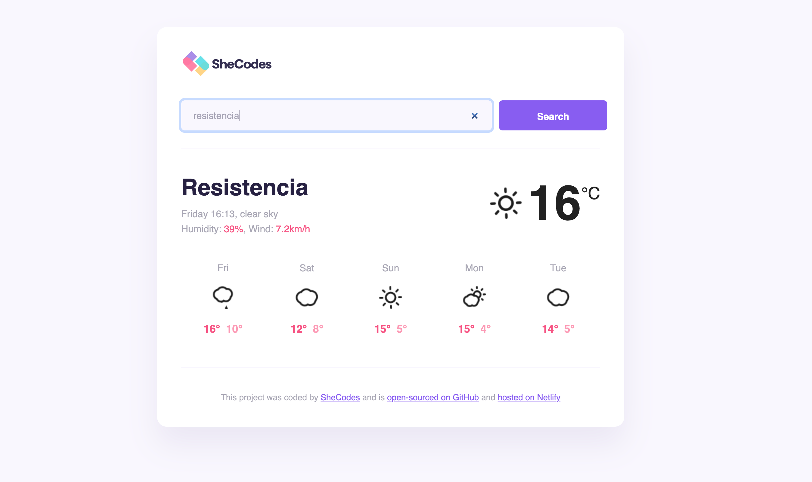

# Bootcamp DevOps by RoxsRoss

---

🔥🔥🔥🔥

# React Weather App

Esta es una aplicación web que permite a los usuarios buscar las condiciones climáticas de cualquier ciudad del mundo y proporciona información meteorológica actual. La aplicación obtiene datos meteorológicos utilizando la API de [SheCodes Weather](https://www.weather.shecodes.io/).

# Características

- Los usuarios pueden buscar las condiciones climáticas de cualquier ciudad del mundo.
- La aplicación muestra las condiciones climáticas actuales, incluyendo la temperatura y la descripción del clima.
- La aplicación utiliza la API de SheCodes Weather para obtener datos meteorológicos.

# Tecnologías y Herramientas Utilizadas

- React.js
- HTML
- CSS
- JavaScript
- VS Code
- API de SheCodes Weather

# Instalación y Uso

Para utilizar esta aplicación, puedes seguir estos pasos:

- Clona el repositorio o descarga el código fuente.
- Abre el proyecto en tu editor de código preferido.
- Ejecuta `npm install` para instalar las dependencias necesarias.
- Ejecuta `npm start` para iniciar el servidor de desarrollo.
- Abre tu navegador y navega a `http://localhost:3000` para usar la aplicación.

Para usar la aplicación, simplemente escribe el nombre de la ciudad que deseas buscar en la barra de búsqueda y presiona Enter. La aplicación mostrará las condiciones climáticas actuales para la ciudad buscada.

# Créditos

- La aplicación del clima fue creada por [s-shemmee](https://github.com/s-shemmee) como proyecto final para el taller de SheCodes React.
- La aplicación utiliza la API de SheCodes Weather para obtener datos meteorológicos.
- Mejorada por RoxsRoss

# ¡Dale una Estrella! ⭐

***Si estás planeando usar este repositorio para aprender, por favor dale una estrella. ¡Gracias!***

> Recuerda documentar los pasos y decisiones tomadas durante la configuraciónde este proyecto ¡Buena suerte!